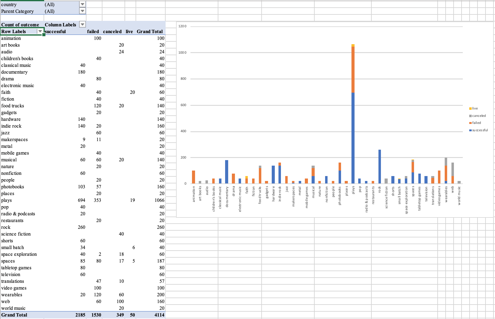

# Kickstarter_Analysis

## Background

Modify and analyze the data of 4,000 past Kickstarter projects to uncover some market trends.

View campaigns by state (live, cancelled, failed, successful) and Category

 Same view by sub-category:
  

  
Outcomes based on launch date:
  

Outcomes based on goal: 

## Given the provided data, what are three conclusions we can draw about Kickstarter campaigns?

1.) The overwhelming majority (839 or 34%) of Kickstarter campaigns are associated with the “theatre” category. The next closest is “music” (540 or 17%). 

2.) Within the “Theatre” category, the “plays” sub-category has the largest number of successful campaigns (694). This is also the largest number of successful campaigns for all sub-categories. However, the sub-category “Rock” (Music > Rock) had 260 successful campaigns, and zero failures. 

3.) The highest spread between success and fail (success – fail) occurs between February and May. In addition, the % Successful increases and the % Failed decreases as the stated goal increases. 

Based on what I can see, if you want to participate in a successful Kickstarter campaign, choose rock. Otherwise, choose “theatre” or more specifically, “plays”. If you are not interested in these categories it’s best to set realistic funding goals, and start the campaign between February and May. 

## What are some limitations of this dataset?
We don’t know any demographic information about the backers (age, income, education, region, state, city, etc).

## Use your data to determine whether the mean or the median summarizes the data more meaningfully.
I think the median describes both the successful and failed data sets more accurately. 1,022 of the 1,533 failed campaigns had less than five backers (67%). Two of the successful campaigns had 46,699 bakers (combined backers between the two campaigns). This is equal to the total backers in the 1,275 campaigns with the lowest number of backers. 
These factors can lead to a large skew in the mean measurement. 

## Use your data to determine if there is more variability with successful or unsuccessful campaigns. Does this make sense? Why or why not?
My calculations for variability of backers for successful vs failed is in the table below. It is much higher for the pool of successful campaigns. I think this makes sense because of the huge range of backers in successful campaigns (min =1; max =26,457). The max for failed campaigns was 1,293 (a difference of 15,164). Also, 287 of the failed campaigns had zero backers.
	

